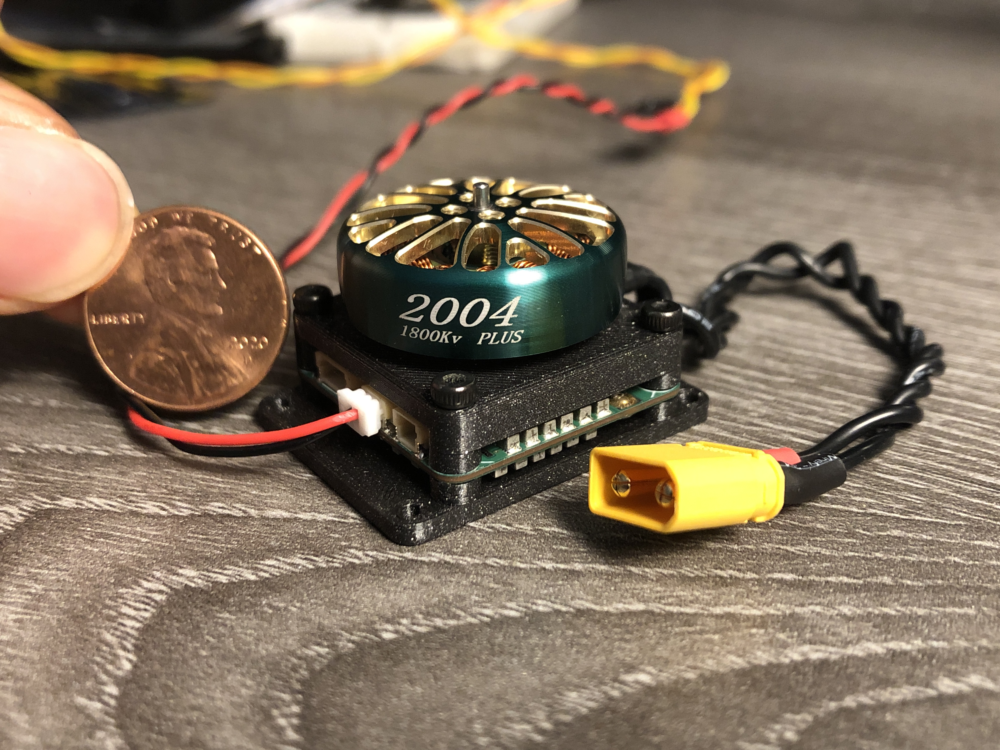
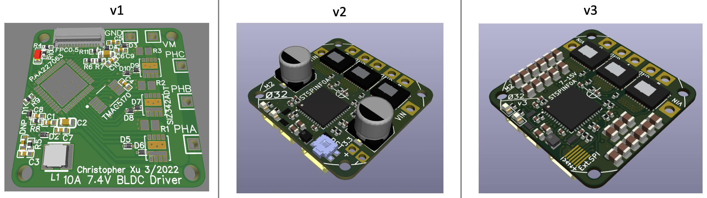

Small robots often use servos or small brushed DC motors, but they are not as power dense as the brushless DC (BLDC) motors commonly found in drones. Called the Ø32 because the M2 mounting holes are on a 32mm diameter circle, this project controls 7-15V motors with accurate position feedback and field-oriented control (FOC), while fitting almost completely behind a 2304 or larger drone motor.

Specs:
- 27mm x 27mm x 0.8mm, 4-layer, 1oz copper PCB
- M2 mounting holes on a 32mm diameter circle
- 7-15V input, bus voltage sensing
- MCU internal temperature sensor and external NTC reading
- built-in high speed 12-bit magnetic angle sensor and external SPI encoder port (3.3V)
- 3 shunt current sensing and overcurrent protection 
- 2x 2-pin JST-SH connectors for RS-485 communication, allowing daisy chaining
- 1x 4-pin JST-SH connector for SWD programming/debug and UART_TX output

Critical components:
- STSPIN32F0A BLDC gate driver and Cortex-M0 MCU
- MA702 magnetic angle sensor
- CSD88584Q5DC half-bridge (50A continuous)

More info on Hackaday.io: https://hackaday.io/project/189115-32-bldc-controller

Firmware here: https://github.com/qwertpas/O32controller_FW

Changelog from v2 to v3:
- Fixed TVS diode direction on VBUS (!!)
- Changed to 37x 22uF ceramic capacitors instead of 2x 100uF electrolytic capacitors for a thinner PCBA
- Removed I2C (formerly on PB6 and PB7)
- Moved UART_TX and UART_RX to PB6 and PB7 (formerly on PA2 and PA15)
- Changed PA2 to ADC1 CH2 to read a 10k NTC, soldered to pads
- Changed PA15 to GPIO for external SPI CS (MAG2_CS)
- Added 13.7k pulldown on SPI_MISO to keep it determined when no devices selected
- Changed to 100nF filter capacitor on BUS_SENSE instead of 1nF to charge ADC capacitor better and for smoother data
- Changed BUS_SENSE gain to 5x instead of 5.12x to reuse 13.7k resistor
- Removed test point on BUS_SENSE
- Added test point on LED_STATUS (for debugging using GPIO)
- Removed NRST pushbutton to create space
- Added 6 pads with 0.5mm pitch to solder FFC cable for an external SPI encoder
- Changed vias to 0.25mm hole size and 0.55mm plated diameter instead of 0.2/0.5 for easier manufacturability
- Changed minimum track clearance from 0.2mm to 0.16mm to make space for larger vias
- Changed to equal number of vias (27) on the top side of all three shunt resistors
- Changed most silkscreen text to 0.8mm width/height
- Put all footprints and 3D models in project library O32controller 